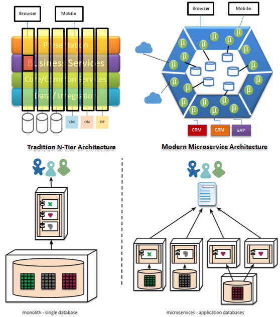

# Microservices

Was sind Microservices und die Herausforderungen.

## Was ist ein Microservice

Die Idee liegt im Wort. Es sind kleine Services. Man unterteilt eine Domain in kleine, voneinander
unabhängige Teildomänen *bounded context*. Microservices nähern sich Modulen, sorgen aber für *
harte* Modularität. Durch getrenntes Deployment wird eine Architektur durch unerlaubte Kopplung
stark erschwert (o(
bzw. sichtbar.))
Eine Einheit wird somit kleiner und schlanker. Das hat aber Konsequenzen bzw. Preis.

## Definition Microservice

Eine Applikation wird aufgeteilt in mehrere, kleine Services welche in einem *
eigenen* Prozess/Plattform laufen. Leichtgewichtige Kommunikation meistvia RESTfull,/http/JSON. sie
sind unabhängig voneinander deploybar (auch Release). Automatisiertes Deployment (DevOps, PaaS,
IaaS).

### Aufteilung einer Applikation in MS

* Applikation primär vertikal in mehrere, möglichst eigenständige Teile auf. Sollen autark arbeiten
  und auf eigene Daten zurückgreifen
* erfordert Aufbrechen des Domänenmodelles in versch. *bounded context*, ist aber schwierig.
  Datenhaltung ist getrennt.
* Einzelne Teile sollten **nicht** direkt miteinander kommunizieren. Einsatz von GUI oder Gateway
  orchestriert.
* Die Grösse eines MS sehr unterschiedlich gross, typisch: Applikation >> MS >= Modul

### Jeder Service hat eigenen Prozess / Plattform

Die Services laufen als eigenständige Prozesse (unterschiedliche Plattformen, OS,
Programmiersprachen) in typisch virtualisierten Container. Sie laufen in echter Parallellität als
verteilte Applikation. Birgt aber ganzes Potential und alle Herausforderungen von verteilten
Systemen (Kommunikation über Netz, Latenz, Skalierung, Ausfall). Nutzt aber ein Client mehrere
Service asynchron, erhöht sich natürlich die Performance. Insgesamt erhöht sich die Komplexität.

### Leichtgewichtige Kommunikation

JSON basierte REST-Schnittstellen sind wegen ihrer «Einfachheit» sehr populär (nach XML). Sind den
die JSON/REST-basierenden Schnittstellen leichtegwichtig? Im Vergleich mit effizienten binären
Protokollen (RMI, RPC etc.) nicht unbedingt. Vorteile sind aber ohne Zweifel auf eine http(s)
basierende Kommunikation relativ leicht zu implementieren und automatisiert testbar.
Authentifizierung und Verschlüsselung ist damit ebenfalls abgedeckt. Auch gute Akzeptanz im
Operating weil bestehende bekannte Protokolle.

### Unabhängig Deploy- und Releasebar

Klar, sind eigenständige Projekte und Releaseeinheiten. Werden erst durch gemeinsame
«Orchestrierung» zur Applikation.

* Kleinere Einheiten einfacher und flexibler entwickelbar (OCP - Open/Closed Prinzip)

Weil unabhängig Deploybar müssen Applikationen damit umgehen können, dass einzelne Teile/MS
ausfallen oder nicht verfügbar sind. Ausfälle werden genrell häufiger. Haben fünf Services eine
Verfügbarkeit von 95%, ergeben sich 0.95^5 = 77% Gesamtverfügbarkeit. Die *Resilienz* wird wichtig!

### Deployment automatisiert

Im Gegensatz zu monolithischen Deployments, wo manuelles Deployment häufig, ist dieses Szenario mit
nur 10 MS nicht haltbar. Alle Abläufe würden um Faktor 10 verlängern. Automatisierung ist für MS ein
absolutes *Muss*-Feature.

## Herausforderungen und Potential von MS

Schichten (horizontal) und Microservices (vertikal) sind orthogonal (gelbe Spalten). Idealerweise
befände sich bei einem Schnittpunkt ein Modul (Organes Quadrat). Entscheidend ist die Grösse und
Schnitt der Einheit. Abhängigkeiten zwischen den MS sollen unbedingt minimal sein.

Auf der Grafik sieht man links bei der DB weiteres Optimierungspotential (siehe Farben n-Tier und
monolith DB)

{width=40%}

## Schnittstellen und Kommunikation zwischen MS

Zentrale Herausforderung sind die *Abhängigkeiten* welche bei MS primär durch Kommunikation. Ziel
ist also möglichst wenig, minimale wenn nicht keine Kopplung. Microservices forcieren die
Modularisierung, verlagern aber die Herausforderungen ins Deployment und *Operating*.

### Kommunikation zwischen Client und [Port-]Micorservice

Mittels leichtgewichtigen Kommunikationsmittel, häufig REST im JSON oder XML-Format. Mehrheitlich *
synchrone* Kommunikation (für unmittelbares Feedback). Damit nicht jeder Client jeden MS kennen
muss, nutzt man *Gateway-Pattern* welches zusammengefasste, einheitliche Schnittstelle.

[Gateway-Pattern](images/app-gateway.png){width=50%}

Entspricht dem Konzept des Fassaden-Patterns (GoF) auf Ebene Architektur. Kann Authetifizierung und
Verschlüsselung oder einfache Mappings/Tranformationen von Daten vornehmen. Wird explizit als
eigenen Service implementiert, es gibt aber auch generische Gateways.

### Inter-Kommunikation zwischen MS

Direkte Kommunikation zwischen MS vermeiden, führt zu starke Kopplung. Dazu sollten *Queues* aus der
Message-Oriented Architektur genutzt werden.

* Wenn immer möglich asynchron
* Events/Messages und Commands
* synchrone Kommunikation vermeiden

Neue Services können elegant und lose gekoppelt registrieren und so neue Funktionalitäten dynamisch
ergänzen.

## Anforderungen an Resilienz

Resilienz beschreibt die Widerstandsfähigkeit bei Teilausfällen um wesentliche
Systemdienstleistungen aufrechtzuerhalten. Bezogen auf MS, ein Service soll weiter funktionieren,
falls andere nicht verfügbar sind.

Für Ausfall eines Services gibt es zwei Szenarien.

1. Komplett weg, Verbindung kann nicht aufgebaut werden. Fehler wird schnell erkannt, da Abbruch
   stattfindet.
1. Service arbeitet langsamer, Antwortzeiten grösser, Aufrufer ist länger blockiert (synchron),
   läuft aber nicht in Timeout

### MS Pattern: Circuit-Breaker

Transparenter *Circuit-Breaker*-Proxy wird zwischen synchroner Kommunikation zwischen zwei Services
API-Gateway zu Port-MS. Dieser misst die Zeit zwischen Requests, wenn Threshold überschritten bricht
er alle neuen Request ab. Nach definiertem Timeout öffnet sich Proxy wieder und prüft erneut.
Vorteil Aufrufer brechen schnell ab, es werden weniger Ressourcen verschwendet.

### Patterns

Einige Patterns nachforschen. ARC30 -> Folie 25

## Umgang mit Transaktionen

MS und globale Transaktionen vertragen sich nicht, weil sie enge semantische Kopplung verursachen.
Das möchte mit MS vermieden werden. Als Lösungsansatz dienen:

* das *SAGA*-Pattern
* getrennte Services zusammenfassen
* fachliche Umgestaltung und Transaktionen minimieren

### Transaktionen fachliche Betrachtung

Durch schwierigen Umgang mit Transaktionen bei MS überlegt man genauer, welche temporären, nicht
kritischen Inkonsistenzen man zulassen kann. Zum Beispiel Bestätigungsmail - unkritisch. Teile die
bisher synchron laufen, werden herausgebrochen und neu asynchron und damit unabhängig verarbeitet.

## Deployment von Microservices

Technologien wie Docker-Images und -Container, gar *server-less* sind zwingend $\rightarrow$ DevOps
lässt grüssen.

### Deployment von Java-basierten Services

Klassische Applikations-Container sind auf grosse Applikationen die lange und stabil laufen
konzipiert. Entsprechend konsumieren diese viele Ressourcen und haben lange Start- und
Initialisierungszeiten. Damit keine Option für MS, falsches Konzept. Daher die Idee von *
Microprofile* aber war nicht wirklich nutzbar. Seit 2018 mit Java 9 ist Java fit für MS

## Logging, Metrics und Tracing

Durch kleine, verteilte Services wird Logging, die durchgängige Verfolgbarkeit von (Geschäfts-)
Prozessen und Schritte und die Überwachung von Performance und Ressourcen herausfordernd. Auch
Debuggen über mehrere MS ist schwieriger als bei einer klassischen Architektur.

### Logging in OWASP

Ungenügendes Logging und Monitoring ist auf Rang 10 der OWASP-Liste. Hauptfehler ist, dass
essentieelle Ereignisse gar nicht oder nur mangelhaft geloggt werden. Seriöses Loggen wird immer
wichtiger. Ein Loggingkonzept ist festzulegen mit *was* geloggt wird und *welches* Format verwendet
wird. Technik ist dabei sekundär. Einhaltung der Konventionen verlangt *hohe* Eigendisziplin aller
Entwickler. Maschinell auswertbare Logformate verwenden.

### Metriken

Laufzeitmetriken sind explizit programmierte *Messpunkte* um Leistungsdaten zu meessen.

* Zähler (Anzahl Ereignisse)
* Messwert (Anzahl Elemente in Queue)
* Meter (Messwert/Zeiteinheit)
* Histogramme (statistische Verteilung von Messwerten wie Mittelwert, Min, Max)

Erste Herausforderungen die Auswahl sinnvoller Messpunkte. Vorhandene Technologien und Werkzeuge
einsetzen (oft als Infrastrukturdienste). Vorsicht, Metriken kosten auch Laufzeit. Auswertung an
Dritt-Tools delegieren und auch hier auf offene Formate setzen. Metriken sind *kein* Ersatz für
detailliertes Profiling.

### Tracing

Aufruf von mehreren Folgeaktivitäten (über Services) verfolgen. Jedem Request wird ID (als
Fingerabdruck) hinzugefügt und reicht diese jeweils weiter. Somit unabhängig vom zeitlichen und
örtlichen Kontext, aber ganzer Requeest einfach nachvollziehbar. Die Correation-ID wenn möglich *
nicht* auf Ebene fachlichen Schnittsteellen (SoC) einfügen und nur wenn kein eindeutiges fachliches
Attribut (eindeutige Bestellnummer, Transaktionsnummer). Remote-API in Kontext verscchieben (
http-Header).

#### Tracing Server

Vergleichbar zu zentralen Logsenken. Erlaubt fachliche Prozesse über das ganze System zu verfolgen.

## Service Discovery

Mit MS herrscht grosse Dynamik und es gibt viel mehr Umgebungen. Wie finden sich Services im Umfeld
von Docker, Port-Mapping und Netzwerke?

### Service Discovery Dienste

Schlanke, spezielle Dienste vergleichbar mit «lokalen» DNS oder RMI-Registry die logischen Namen
einem oder mehreren Services (IP und Port) zuweisen. Können teilweise Load-Balancing übernehmen
indem sie registrierte Services selbstständig monitoren (Service Mesh).

## Technologien und Frameworks (Beispiele)

Jeweils mit Java

* Jetty, http-Server
* Dropwizard, für Metriken - relativ unbekannt trotz Alter
* Jakarta EE, Microprofiling im Enterprise-Umfeld

Mächtige Frameworks

* Spring, Spring Boot spezifisch für MS, Schwäche ist Laufzeit-Annotations während Laufzeit (
  verzögert Startzeiten)
* Micronaut, spezialisiert für MS und Serverless Applikationen, Compile-Time Annotation, dynamische
  Entwicklung, starke und flexible Integration von Infrastrukturdienste

Nativ kompilierte Java-Anwendungen

* GraalVM, alternative Runtime-VM, mehrsprachig (Java, Groovy, Kotlin, ...), kann App nativ (
  plattformspezifisch) erzeugen, Startzeit von $s$ auf $\mu s$ reduziert
* Quarkus, Kubernetes Stack für OpenJDK oder GraalVM, native Ausführung, optimiert für Kubernetes -
  small footprint

Top-Level Framework

* Jhipster, orchestriert nicht nur Runtime, sondern ganzen Entwicklungsprozess.
  Boilerplate-Codegenerieerung, Konfig, Dependencies, Buildprozess, Testing, Dev, Security

## Übung - Potential von Microservices

Was sind die Vorteile / das Versprechen von Microservices?

* Services können einfach ersetzt werden
* Ein Service ein Bounded Context
* sind gegen andere Services isoliert
* Kommunikation zwischen Teams reduziert sich, weil nur Schnittstellen vorhanden
* sind klein und übersichtlich und dadurch langfristig wartbar
* erlaubt Experimente (zB. Programmiersprache) in kleinem Rahmen
* Services unabhängig voneinander skalierbar
* überschaubar, unabhängig und gut wartbar
* können agil angepasst werden

Was sind die Nachteile von Microservices?

- verteilte Architektur erzeugt Komplexität besonders im Bereich Netzwerklatenz, Lastverteilung,
  Fehlertoleranz (Resilienz und Asynchronität)
- Logging & Monitoring wird komplex und herausfordernd
- Zeitsynchronisation
- Datenkonsistenz / Transaktionssicherheit muss gewährleistet sein
- DevOps ein muss! Anforderungen an Operating

## Übung - Microservice Patterns

Studieren und Diskutieren Sie die folgenden, ausgewählten Patterns.

### Reliability - *Circuit Breaker*

When one service synchronously invokes another there is always the possibility that the other
service is unavailable or is exhibiting such high latency it is essentially unusable. Precious
resources such as threads might be consumed in the caller while waiting for the other service to
respond. This might lead to resource exhaustion, which would make the calling service unable to
handle other requests. The failure of one service can potentially cascade to other services
throughout the application.

#### Problem

How to prevent a network or service failure from cascading to other services?

#### Solution

A service client should invoke a remote service via a proxy that functions in a similar fashion to
an electrical circuit breaker. When the number of consecutive failures crosses a threshold, the
circuit breaker trips, and for the duration of a timeout period all attempts to invoke the remote
service will fail immediately. After the timeout expires the circuit breaker allows a limited number
of test requests to pass through. If those requests succeed the circuit breaker resumes normal
operation. Otherwise, if there is a failure the timeout period begins again.

#### Resulting Context

This pattern has the following benefits:

* Services handle the failure of the services that they invoke This pattern has the following
  issues:
* It is challenging to choose timeout values without creating false positives or introducing
  excessive latency.

### Data-Management - *Saga-Pattern*

You have applied the Database per Service pattern. Each service has its own database. Some business
transactions, however, span multiple service so you need a mechanism to implement transactions that
span services. For example, let’s imagine that you are building an e-commerce store where customers
have a credit limit. The application must ensure that a new order will not exceed the customer’s
credit limit. Since Orders and Customers are in different databases owned by different services the
application cannot simply use a local ACID transaction.

#### Problem

How to implement transactions that span services?

#### Solution

Implement each business transaction that spans multiple services is a saga. A saga is a sequence of
local transactions. Each local transaction updates the database and publishes a message or event to
trigger the next local transaction in the saga. If a local transaction fails because it violates a
business rule then the saga executes a series of compensating transactions that undo the changes
that were made by the preceding local transactions.

There are two ways of coordination sagas:

* Choreography - each local transaction publishes domain events that trigger local transactions in
  other services
* Orchestration - an orchestrator (object) tells the participants what local transactions to execute

#### Resulting context

This pattern has the following benefits:

* It enables an application to maintain data consistency across multiple services without using
  distributed transactions

This solution has the following drawbacks:

* The programming model is more complex. For example, a developer must design compensating
  transactions that explicitly undo changes made earlier in a saga.

There are also the following issues to address:

* In order to be reliable, a service must atomically update its database and publish a
  message/event. It cannot use the traditional mechanism of a distributed transaction that spans the
  database and the message broker. Instead, it must use one of the patterns listed below.

### External API - *API-Gateway*

Umgesetzt im Projekt

### Cross cutting concerns - *Microservice chassis*

When you start the development of an application you often spend a significant amount of time
putting in place the mechanisms to handle cross-cutting concerns. Examples of cross-cutting concern
include:

Externalized configuration - includes credentials, and network locations of external services such
as databases and message brokers Logging - configuring of a logging framework such as log4j or
logback Health checks - a url that a monitoring service can “ping” to determine the health of the
application Metrics - measurements that provide insight into what the application is doing and how
it is performing Distributed tracing - instrument services with code that assigns each external
request an unique identifier that is passed between services. As well as these generic cross-cutting
concerns, there are also cross-cutting concerns that are specific to the technologies that an
application uses. Applications that use infrastructure services such as databases or a message
brokers require boilerplate configuration in order to do that. For example, applications that use a
relational database must be configured with a connection pool. Web applications that process HTTP
requests also need boilerplate configuration.

It is common to spend one or two days, sometimes even longer, setting up these mechanisms. If you
going to spend months or years developing a monolithic application then the upfront investment in
handling cross-cutting concerns is insignificant. The situation is very different, however, if you
are developing an application that has the microservice architecture. There are tens or hundreds of
services. You will frequently create new services, each of which will only take days or weeks to
develop. You cannot afford to spend a few days configuring the mechanisms to handle cross-cutting
concerns. What is even worse is that in a microservice architecture there are additional
cross-cutting concerns that you have to deal with including service registration and discovery, and
circuit breakers for reliably handling partial failure.

#### Forces

Creating a new microservice should be fast and easy. A service must implement cross-cutting concerns
such as externalized configuration, logging, health checks, metrics, service registration and
discovery, circuit breakers. There are also cross-cutting concerns that are specific to the
technologies that the microservices uses.

#### Solution

Build your microservices using a microservice chassis framework, which handles cross-cutting
concerns

#### Example

Examples of microservice chassis frameworks:

* Java
    - Spring Boot and Spring Cloud
    - Dropwizard
* Go
    - Gizmo
    - Micro
    - Go kit

#### Resulting context

The major benefit of a microservice chassis is that you can quickly and easy get started with
developing a microservice.

You need a microservice chassis for each programming language/framework that you want to use. This
can be an obstacle to adopting a new programming language or framework.
