# Messaging

Von einem Monolith zu einem Service-Oriented System.

Wie soll ein Service in einem service-oriented System aussehen? Ein Service

* hat Interfaces
* hat Business Logik
* hat und verarbeitet eigene Daten

## Serviceaufruf

Wie wird ein Service aufgerufen? Folgendes Beispiel ist Total falsch. Man sollte keine Methoden auf
einem Service aufrufen.
```double MyAwesomeService(double paramA, int paramB)```

- ist nicht erweiterbar, was passiert wenn dritter Parameter dazukommt?
- Hohe Kopplung zwischen Aufrufer und Service
- dies entspricht RPC und nicht service orientiert
- In einem service-oriented Umfeld gibt es keine Methodenaufrufe

In einem service-oriented Umfeld werden Nachrichten verschickt

`Response MyAwesomeService(Request request)`

+ kann als JSON oder was auch immer enthalten

- Akzeptiert die Request nachricht

+ die Nachricht kann serialisiert werden
+ Service schickt Antwort zurück -wieder serialisiert

Noch nicht ganz ideal

### Service-Orientierte Methode

`void MyAwesomeService(Request request)`

+ Aufruf ist asynchron
+ Anfrage wird in Queue gespeichert
+ Service hört auf dieser Queue
+ Falls er antworten muss, schickt er die Antwort auch in eine Queue

Dadurch asynchrone Kommunikation mit Queues. Vorteile von asynchron sind klar:

* Verfügbarkeit; ein Service kann ausfallen und der Aufrufer muss Fehler und Recovery handhaben
  können
* Fehlerresistenz; wenn Service down, wird Caller in Timeout fahren
* Erweiterbarkeit; synchrone Kommunikation führt zu grösserer Kopplung, Kosten für Modifikationen
  sind höher
* Skalierbarkeit; wie kann Service skalieren, wenn grosse Last?

## Skalierbarkeit

### Skalieren in einem synchronen Umfeld

Skalieren durch mehrere Instanzen des gleichen Services in einem synchronen Umfeld, braucht man dazu
aber einen *Load Balancer*. Dieser kostet, benötigt Knowhow über die Technologie und führt neue *
Point-of-Failure* ein.

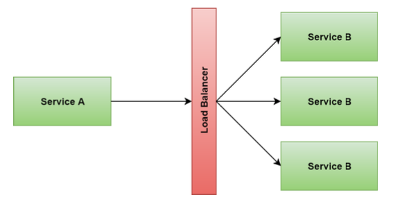{width=50%}

### Skalieren in einem asynchronen Umfeld {#scale-anchor}

Da bereits alle Services in Queues lesen führ die Skalierung durch mehrere Instanzen nur zu wenig
mehr Kosten (ein paar Container), fügt aber keinen neuen *Point-of-Failure* hinzu. Die neuen
Instanzen von *B* (deren Worker) hören einfach auf die gleiche Queue.

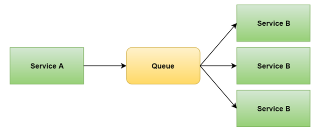{width=50%}

## Messaging Basics

MS müssen miteinander kommunizieren. Es gibt verschiedene Verfahren, welche alle ihre Vor- und
Nachteile haben.

* Advanced Message Queuing Protocol (AMQP)
* REST
* REST mit HTTP/2 push
* SOAP
* RPC

Eine Nachricht triggert evtl. eine Antwort, welche auch eine Nachricht ist. Eine Message kann auch
von einem oder mehreren Empfänger verarbeitet werden.

* **Message** ist eine Informationeinheit, welche durch System gesandt wird. Sie hat einen Header
  mit Metadaten und einen Body, welcher meist Daten in binärer Form enthält.
* **Producer** (Akteur) erstellt und schickt Nachrichten
* **Consumer** (Akteur) erhält und verarbeitet Nachriten
* **Queue** Eine Sammlung die Nachrichten in einer Warteschlange stellt und durch Consumer abgeholt
  werden

Nachrichten basierende Systeme nutzen typischerweise ein Messaging-System, auch *message-broker
software* oder *message-oriented middleware* genannt.

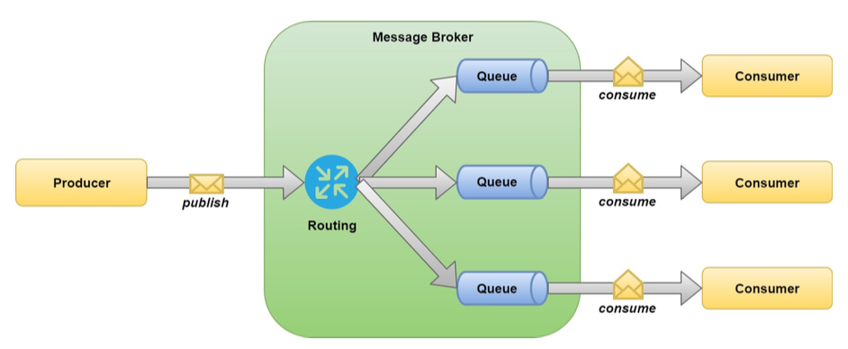{width=90%}

Das Routing schickt Nachrichten weiter, an die Queues, die Nachricht von Producer abonniert haben.
Wenn Consumer Zeit haben, holen sie die Nachrichten ab. Der grüne Teil wird von eben diesen *
Message-Broker*-Systemen übernommen.

## Vorteile durch Messages

* **Resilienz** Nachrichten gehen nicht im Netz verloren wenn Netzwerk down ist. Sie werden
  Zwischengespeichert und ausgeliefert wenn Netz wieder da ist
* **Fehlertoleranz** Die Nachricht kann einfach wieder gesandt werden, wenn Fehler auftritt oder
  Service down
* **Asynchronität** die Services können andere Aufgaben wahrnehmen sobald Nachricht verschickt
  worden ist, egal ob diese noch unterwegs oder schon verarbeitet wird
* **Entkoppelung** Die kommunizierenden Services kennen einander nicht und sind so voneinander
  unabhängig/entkoppelt (klar das Nachrichtenformat ist bekannt)
* **Effizient und Skalierbar** Asynchrone Nachrichten sind der Schlüssel für Effizienz und
  Skalierbarkeit

## Message-orientiert Denken

Man sollte in Nachrichten anstatt im System denken. Den Datenfluss sollte nicht modelliert werden.
Die Services sollen sich nicht kennen. Diese senden einfach Nachrichten ans Universum. Verteilte
Systeme sind schwierig, daran ändern auch Microservices und Messages nichts.

### Message-first approach

Kann helfen das System zu designen.

* Die Anforderungen enthalten den Status der Aktivitäten die im System ablaufen sollen, was geht
  rein - was raus
* Die Nachricht drücken eine Intension aus, was passieren soll, wenn die Nachricht verschickt werden
  soll
* die Anfoderungen können also in Nachrichten transformiert können
* Nachrichten können konzeptionelle Ebene zwischen Business Requirements und technischer System
  Spezifikation sein

#### Nachrichten Modellierung

Beispiel Webshop. Kunde wählt Produkte aus und fügt sie in den Warenkorb. Später bestellt er sie und
erhält eine Bestätigungsmail und der Versand wir duasgelöst.

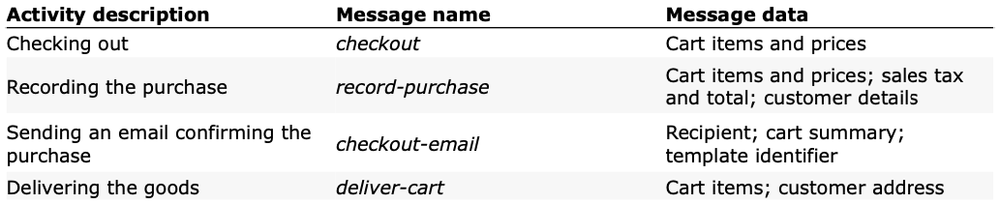{width=90%}

## Synchron und Asnychron

Kommunikation kann auf technischem Level synchron oder asynchron erfolgen. Die Kommunikation via
HTTP erfolgt synchron udn ist ein **request/response** Modell. Ein Szenario mit Nachrichten und
Queues ist asynchron auf dem technischen Leve.. Auf einem konzeptuellen Level kann die Kommunikation
synchron oder asynchron erfolgen, egal wie es technisch umgesetzt wurde. In einem synchronen
Szenario wenn der Sender auf eine Antwort wartet ist er blockiert. Wenn er aber darauf vorbereitet
ist, kann er darauf reagieren, bis das Resultat zurück ist. Dies ist dann asynchrone Kommunikation.

Wenn immer möglich asnychrone Kommunkation einsetzen, denn synchrone führt zu höherer Kopplung.
Asynchrone systeme sind eher Event*event-driven*.

## Routing

Services wissen nicht genau, wer ihre Nachrichten liest. Sie schicken ihre Nachrichten einfach an
einen Message-Broker. Diese werden anhand den Headerinformationen vom Broker weitergeleitet.

### Patteren Matching

Ein Service gelangt mittels *Pattern Matching* an die Nachrichten an die er interessiert ist. Damit
können Nachrichten vonvom gleichen Typ gruppiert werden. Damit diese dynamisch weitergeleitet werden
können, implementieren wir einen Namespace für diese Nachrichten.

#### Labels

Labels sind im Message Header und können beliebige *key-value-pairs* enthalten. Mit einem Label-Key
im Header kann das routing nun wie folgt gemacht werden.

{width=50%}

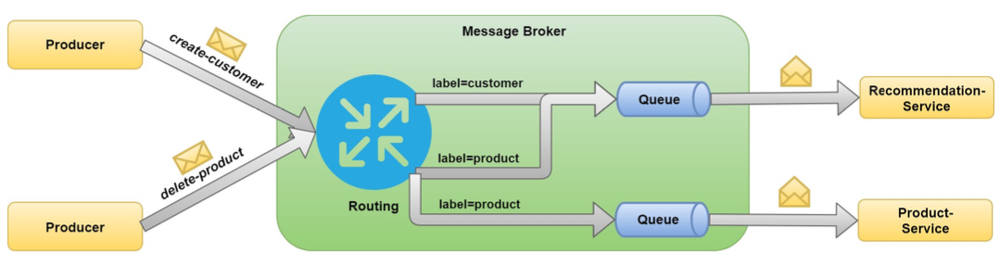{width=90%}

#### Hierarchical Naming

Die Nachrichten werden anders benannt, ähnlich wie Packages.

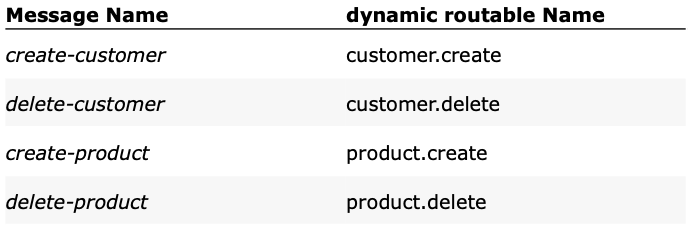{width=50%}

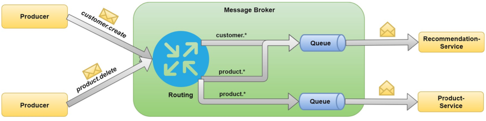{width=90%}

### Response Message routing

Der Sender fügt im Header der Nachricht das optionale *ReplyTo*-property hinzu, welches die Adresse
der Queue beinhaltet wohin die Response gehen soll.

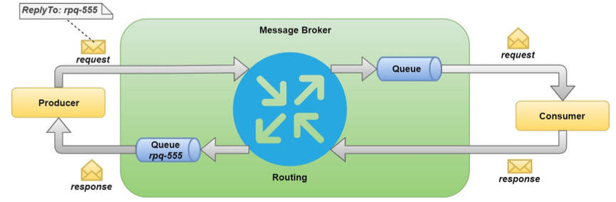{width=90%}

## Reliable Delivery

Wie kann sichergestellt werden dass alle Nachrichten eintreffen? Grundsätzlich muss Transportmedium
als *unzuverlässig* betrachtet werden (Netzwerkausfälle, HW failure, Serviceausfall). Der
Message-Broker kann Nachrichten im Fehlerfall neu zustellen. Aber auch er muss wissen, ob die
Nachricht zugestellt wurde und von der Queue gelöscht werden kann. Dazu muss der Empfänger den
Empfang *oder* die Verarbeitung bestätigen *acknowledgments (ACK)*.

Acknowledgments gibt es in beide Richtungen und bestätigen, dass die Nachricht **mindestens einmal**
zugestellt wurden.

## Messaging Systems - RabbitMQ

Ein *message-broker* ist ein zentrales System mit Warteschlagen. RabbitMQ wurde entwickelt um AMQP
und weitere Protokolle und viele Programmieresprachen zu überstützten. Es ist OpenSoruce und
leichtgewichtig.

### Concepts

Bestehend aus drei grundlegenden Konzepten

* **Exchange** erhält Nachrichten und verteilt diese an Queues auf Basis von Routing-Rules.
* **Queue** eine Sammlung an Nachrichten diese später vom Consumer abgeholt werden
* **Bindings** eine Konfiguration, die Exchange zu einer Queue mappt und das Routing definiert (
  mapping)

### Types of Exchange

Es gibt bei RabbitMQ die drei Typen

* **Direct** nutzt den Queuenamen als binding pattren
* **Fanout** verteilt Nachrichten an all angeschlossnen Queues ohne explizites Routing
* **Topic** nutzt Routing-Schlüssel und Pattern-Matching um Nachrichten zu verteilen, bietet grösste
  Flexibilität

### Connect to RabbitMQ

Dazu müssen zwei Komponenten bekannt sein.

* **Connection** ist eine TCP Verbindung zu RabbitMQ. Es ist eine Verbindung pro Prozess zu
  verwenden und diese offen lassen. Öffnen und schliessen sind «teuer».
* **Channel** ist eine virtuelle Verbindung in einer Connection. Sind aber leichtgewichtiger. Auch
  hier offen lassen. Pro Thread ein Channel (Channel sind nicht threadsafe).

## Messaging Patterns

* **Synchron/Asynchron** Sender erwartet eine/keine Antwort
* **Observe/Consume** die Nachricht kann nur vom ersten Verarbeitet werden oder dürfen noch weitere
  die Nachricht lesen

### Fire and Forget

Purste Form (in MS) der Kommunikation ist asynchron und werden nicht *consumed*, Nachricht existiert
weiter und darf von allen gelesen werden. Entspricht dem *publish-subscribe* pattern

{width=40%}

### Winner take all

Kommunikation ist asynchron und werden aber *consumed*, Nachricht kann nur von eiem gelesen werden.
Typischerweise in einem Szenario wo mehrere Worker parallel arbeiten.

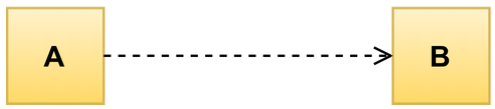{width=40%}

### Request/Response

Ist wie Klassische HTTP oder REST Kommunikation. Ist synchron und Nachrichten werden *consumed*. Der
Sender erwartet eine Antwort auf den Request.

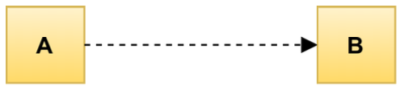{width=40%}

### Synchronous-Observed

Synchrone Kommunikation aber Nachrichten werden nicht *consumed*. Der Sender erwartet eine Antwort.
Weitere Services können mithören, aber der Sender ist nur an einer Antwort interessiert.

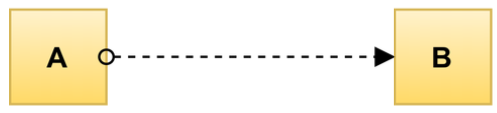{width=40%}

### Dead Letter Queue

Darin werden alle Nachrichten gesammelt die aus diversen Gründen nicht zugestellt werden konnten.
Damit können potentielle Probleme im System aufgedeckt werden.

## Scaling and Back Pressure

Asynchrone Kommunikation hat viele Vorteile, aber es gibt auch einige Herausforderungen wenn das
System stark ausgelastet ist.

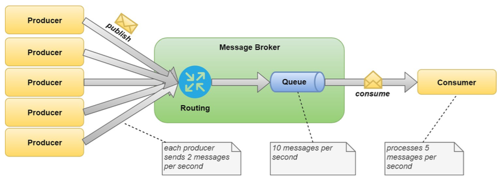{width=90%}

Dauert dieser Zustand an, wächst die Queue ins unendliche. Eine Möglichkeit
ist [Skalierung](#scale-anchor). Die andere Möglichkeit ist das Anwenden von *backpressure*
-Strategien auf die Produzenten. Diese werden so verlangsamt.

* synchrones Ausbremsen
* Load Shedding, Queue ist limitiert - Pakete werden verworfen wenn Threshold erreicht
* Flow Control - Bandbreite wird limitiert, damit Producer ausgebremst werden -> RabbitMQ macht dies
  per default (kann anderes konfiguriert werden)
