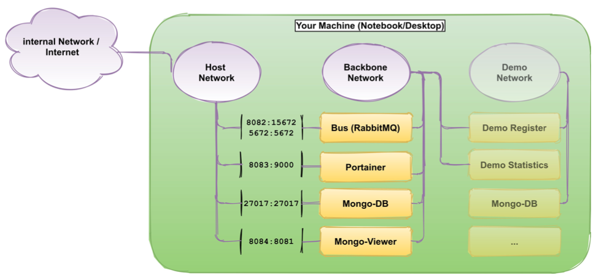

# Docker

Vereinfacht das bereitstellen von Anwendungen via Container, weil diese alle nötigen Pakete
beinhalten und sich so als Dateien transportieren und installieren lassen.

## Container

Isolierter Prozess auf einer Maschine, mit seinem eigenen *Namespace*. Er hat/kann

* Kann keine anderen Prozesse sehen.
* Isolierter Netzwerkstack, kann andere Prozesse nicht beeinflussen.
* eigene cgroup (beschränkter Zugriff auf Memory, CPU, Disks)
* eigenes root-file System (kann keine anderen Files anlangen)

## Image

Ein Template um Docker Container zu erstellen. Wenn ein Container ein Objektinstanz ist, ist das
Image die Klasse

## Dockerfile

Textfile um ein Docker-Image zu erstellen. Es ist der Sourcecode um das Image zu erstellen.

## Using Backbone-Stack

1. Start the services:
   `docker-compose -f docker-compose.local.yml up`
2. Ensure all services (containers) are running:
   `docker-compose -f docker-compose.local.yml ps -a`
3. Display the logs of all services or of a single service:
   `docker-compose -f docker-compose.local.yml logs -f`

### Local Version

Enthält essentielle Services für unsere Microservice-System.

The local version can be used to run the system locally on you machine for development. It is
defined in the file docker-compose.local.yml. This version contains the following services:

- bus: RabbitMQ as messaging system. Our microservices communicate over this bus.
- portainer: A web-based tool to monitor all your docker artefacts such as containers, networks....
- mongodb: A nosql database to store data. No actively used, just for your convenience.
- mongo-viewer: A webbased DBMS for the mongo-db to view and modify the database content. Here we
  use port-mapping to connect these docker container to our host network. In the productive version,
  there will be no port-mapping, but only isolated virtual networks!

#### Network View local Version

Die Netzwerke sind voneinander isoliert. Für den Zugriff werden die Container mittels Port-Mapping
ins lokale Netz exponiert. Definiert werden beide im docker-compose.local.yml (*software-defiend* by
Docker, keyword *network* und *ports*).

{width=60%}

## Service Templates

kurz beschreiben

## Tool Chain - automated CI/CD

Die zur Verfügung gestellte Toolchain macht folgende Dinge:

* Builted Service
* Testing
* Qualitätschecks
* publiziert Service als Docker Image
* Deployt der neue Service als Docker Container
