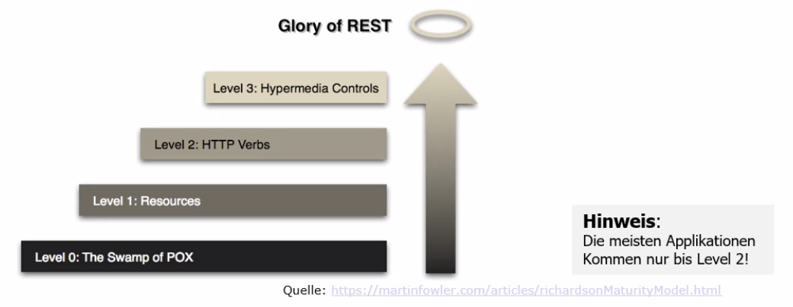

# Architektur - API-Design

Eine API (Application Programming Interface) ist eine Schnittstelle die darauf ausgelegt ist, eine
Softwareeinheit nutzbar zu machen. Besteht aus mehreren Klassen/Interfaces und definiert gemeinsame
Funktionen und Datentypen. Eine API soll

* einfache Nutzung ermöglichen
* Aufwand für Nutzer minimieren
* Unabhängig von konkreter Implementierung sein
* implizites Mass an Öffentlichkeit

## Von der Schnittstelle zur API

Ist eine Frage des Scopes. Technisch betrachtet kann eine Schnittstelle

* im OO-Design zu Implementation existieren
* zu einem Framework
* zu einem Teilsystem
* zu einem System

darstellen. Definition des Scopes wird auf Ebene Architektur. Vorsicht vor nicht als API gedachten
Schnittstellen

### Motivation

**Gute** APIs haben einen grossen Wert. Fordern die Modularität und Entkoppelung und machen
komplizierte einfach nutzbar oder auch austauschbar. Machen es ein Produkt attraktiv. **Schlechte**
APIs verursachen hingegen Ärger und Kosten. Fehlerhafte Nutzung, aufwändige Fehlersuche und Support.
Verführen dazu eine vorhandene Lösung nicht zu nutzen. Verführen zu Workarounds und eher unsaubere
Arbeit.

### Herausforderungen

Öffentlich verfügbare APIs leben fast ewig und somit auch allfällige Designfehler. Änderungen sind
nur mit grossen Aufwand/Konsequenzen änderbar. Meist nur **eine** Chance. Das **entwerfen** einer
guten API ist herausfordern. Die grosse Kunst dabei die API so zu entfernen, dass sie
entwicklungsfähig ist.

### Hauptziele

Hauptziele einer guten API sind maximale Entkoppelung (lose Kopplung) der Implementiation. Maximales
Information Hidding und Kohäsion. Prinzipien wiederholen sich, jedoch ist die Gefahr von Fehler viel
Grösser.

### Qualitätsanforderungen

* Konsistente Namengebung
* einfache, treffende Namen
* Verhalten so erfüllen, wie es erwartet wird
* Erweiterbarkeit für Weitentwicklungen sicherstellen
* einfache und hilfreiche Dokumentation
* Perspektive auf den Nutzer wenden - für ihn soll es einfacher werden
* KISS-Prinzip - möglichst einfach
* Sicherheit - Nutzung sicher gestalten

### API-Patterns

Werden genutzt um Namensgebung und Verhalten vorhersehbar und durchgängig zu gestalten.

* Repetition - gleiche Namen für gleiche Dinge
* Periodisch - gleiche Bezeichnungen für gleiches Verhalten
* Symmetrie - symmetrische Methoden anbieten - open/close oder inuse/free

### SPI - Die «API» für den Anbieter

Die Service Provider Interface ist eine Teilmenge oder Ergänzung zu einer API. Ist für die Anbieter
von Implementationen einer API gedacht.

## Class-based API

Werden über ein/mehrere Interfaces und Klassen realisiert. Typisch in Package bzw. Modul
abgeschlossen mit vollständiger JavaDoc. Klassen die formale Parameter oder als Return genutzt
werden sind automatisch **Bestandteil** der Schnittstelle! In geschichteter entsteht häufig ein
API-Layer (Service-Layer). Oft brechen Datentypen zwischen Schichten - Pro Layer eigene Datentypen
die dann oft reine *Value Objects* (VO) oder *Data Transfer Objects* (DTO) sind.

DTO/VO sind verkleinerte/vergrösserte Entity-Objekte (ViewModels). Diese brechen einzelne Schichten.
Aufwand kann sich vorteilig oder nachteilig auswirken (je nach Auswirkung auf verschiedene Ebene).

### Empfehlungen

Es gelten erwähnte Ziele und Qualitätsanforderungen (Namensgebung, Verhalten, Doku). Möglichst kurze
und einfache Parameterlisten oder Overload verwenden. Für Rückgabetypen Interfaces (`IList`) nutzen.
Ab drei Parameter *Builder Pattern* nutzen. API-Stil an Bedürfnisse/Sprache/Situation an Nutzer
anpassen.

### Fluent API - Stil

Ist das *flüssige* aneinanderreihen von Methodenaufrufen. Als
Beipspiel `LINQ` `list.Where(e => e.Name == "Stofer").Select(e => e.Id);`

### Fehlende Daten

Wie signalisiert eine Schnittstelle fehlende Daten? Bei Get wird etwas nicht gefunden?
Bei ``GetById`` kann man `null` oder eine Exception zurückgeben, da man davon ausgeht, dass die Id
vorhanden ist. Bei einer Liste leere Liste zurückgeben, kein `null`oder Exception.

## REST API

REST heisst *RE*presentational *S*tate *T*ransfer und ist ein *Architekturstil* welcher einen Satz
von Prinzipien definiert. Diese sollen konforme Architektur gewährleisten. Wesentliche sind:

* Statuslose Kommunikation (zustandslos)
* Verwendung von HTTP-Standardmethoden
* Ressourcen mit eindeutiger Identifikation (URI)
* Unterschiedliche Repräsentation von Ressourcen
* Verknüpfungen/Hypermedia (HATEOAS)

Es sollen auch unterschliedliche Protokolle genutzt werden können.

### Zustandslosigkeit

Die Kommunikation **muss** bei REST zustandslos sein. Der Zustand muss entweder vom Client gehalten
werden oder vom Server in einer Ressource abgebildet werden. Der Status der Applikation ergibt
sich *ausschliesslich* aus der Ressourcenpräsentation (URI) und dessen Status. Daher keine
Sitzungsinformationen und keine Sessioninformationen nötig. Vorteile sind Lesezeichen und bessere
Skalierbarkeit der Infrastruktur (Load Balancing - Session auf gleichem Host halten).

### Standardmethoden

REST-konforme Applikationen verwendet die http-Methoden `GET`, `PUT`, `POST`, `DELETE`, usw. verbindlich.
Diese sind als **idempotente** Methoden (ausser Post) zu implementieren. Können beliebig oft
aufgerufen werden ohne Seiteneffekte.

### Identifizierung von Ressourcen

Eine Ressource kann über URI eindeutig angesprochen, identifiziert und als beliebige Datenformate (
XML, JSON, Bild, PDF) genutzt werden. Die Räpresentation ist über `Accept: MIME-Type` wählbar. DIE
URI enthält **keine** Namen von Operationen.

### Schnittstellendesign

Die Bezeichner werden typisch in *Mehrzahl* geschrieben. Die ID's sind **immer** Bestandteil des
Pfades. Nur für Suchargumente werden zusätzliche Attribute übermittelt. Das heisst, dass über die gleiche URI verschiedene Aktionen ausgeführt werden. Unterscheidung lediglich durch die verwendete *http*-Methode (`GET`, `PUT`, `POST`, `DELETE`, usw.)

### Rückgabewerte über Body und http-Statuscode

Mit RESTfull-Schnittstellen über http haben wir mehrere Rückgabemöglichkeiten. Über Body,
Statuscode, Header. Als Konsequenz keine Fehlermeldungen sonder Statuscode zurückgeben.

### Hypermedia-Prinzip

Ist das Prinzip von Verknüpfungen von unterschiedlichen Ressourcen über Links. Wenn Client Antwort
bekommt, kann er enthaltene Verknüpfungen verwenden bzw. folgen.

HATEOAS: Hypermedia As The Engine Of Application State

### RESTfull - Richardson Maturity Model (RMM)

Begriff um zu definieren, dass die wesentlichen REST-Prinzipien im REST-Stack eingehalten werden.
Zur Beurteilung wird RMM herangezogen

{width=50%}

Es werden auch keine festen REssourcennamen oder Hierarchien vorausgesetzt. Server kann URI-Struktur
jederzeit ändern, ohne den Client anzupassen. Client braucht nur Einstiegs-URI zu kennen.

### Versionierung

REST-Schnittstellen können über URI-Pfadanteil relativ einfach versioniert werden. Dadurch
paralleler Betrieb versch. Endpunkte möglich.